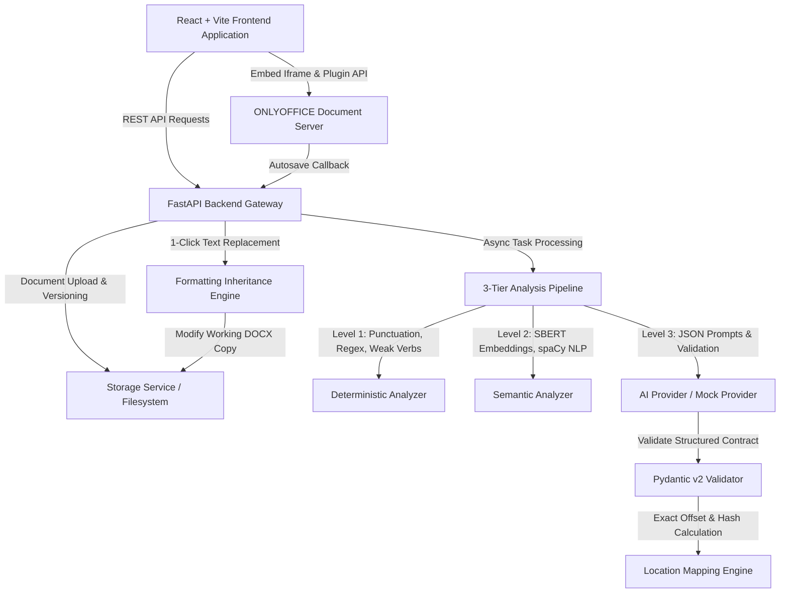

# System Architecture Specification — AI Resume Analyzer (Objective 1)

## 1. System Architecture Overview

---

## 2. Directory & Module Responsibilities

### Backend (`backend/app/`)
- `main.py`: FastAPI app initialization, middleware, CORS, route registration.
- `config.py`: Environment settings, storage paths, AI provider settings.
- `database.py`: SQLAlchemy async database session management.
- `api/`: REST API routers (`resumes.py`, `analyses.py`, `suggestions.py`, `documents.py`).
- `document/`:
  - `docx_parser.py`: Parses DOCX files into normalized sections, paragraphs, runs.
  - `pdf_parser.py`: PyMuPDF layout parsing and text block extraction.
  - `inheritance_engine.py`: Formatting inheritance and XML text replacement.
  - `location_mapper.py`: Location offset and SHA256 hash calculation.
- `analysis/`:
  - `deterministic_analyzer.py`: Regex checks for punctuation, verbs, tech casing.
  - `semantic_analyzer.py`: Skill gap analysis and SBERT/spaCy matching.
  - `job_parser.py`: Job description parsing.
- `ai/`:
  - `provider_interface.py`: AI provider abstract base class.
  - `mock_provider.py`: Reproducible local standalone provider.
  - `prompts.py`: System and user prompt templates.
- `services/`:
  - `storage_service.py`: Managing file storage, original/working copies, version snapshots.
  - `document_service.py`: Document CRUD, normalized store, version history.
  - `ai_service.py`: Orchestrator for 3-tier analysis pipeline.
  - `suggestion_service.py`: 1-click apply, ignore, custom edit, conflict checks.
  - `editor_service.py`: ONLYOFFICE configuration and JWT builder.

### Frontend (`frontend/src/`)
- `components/`:
  - `Header.tsx`: Navigation bar, version badge, undo, download DOCX buttons.
  - `OnlyOfficeEditor.tsx`: ONLYOFFICE editor wrapper.
  - `WebDocumentViewer.tsx`: Interactive preview fallback with yellow review markers (`🟡` / `#FEF08A`).
  - `ReviewPanel.tsx`: Right side AI review panel, match score gauge, filter chips.
  - `SuggestionCard.tsx`: Suggestion cards with priority badges, reasoning, 1-click Apply/Ignore/Edit buttons.
  - `UploadModal.tsx`: Drag-and-drop file upload + preloaded sample demo.
  - `EditModal.tsx`: Custom replacement editor.
- `pages/`:
  - `WorkspacePage.tsx`: Main split-view workspace layout.

### ONLYOFFICE Plugin (`onlyoffice-plugin/`)
- `config.json`: Plugin registration manifest.
- `index.html`: Plugin entry point iframe.
- `plugin.js`: Office API interaction script (`Api.Search`, `Api.ReplaceText`, selection handlers).
